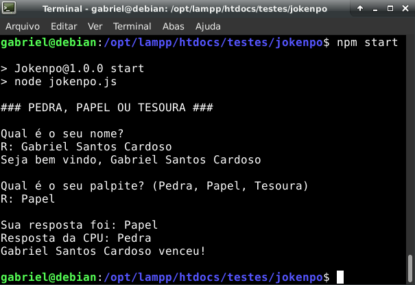

# JOKENPO

## Descrição

Mini-game de Jokenpo (vulgo Pedra - Papel - Tesoura) feito inteiramente com a linguagem Javascript. Basta ter o NodeJS instalado em sua máquina e rodar o comando `npm start` e se divertir!

## Motivação

> Tudo começou em uma tarde de sol, com o objetivo de testar o pacote Readfile do NodeJS. 
 
Minha primeira linha de código em Pascal me trouxe para o mundo da programação e me mostrou um sem número de possibilidades distintas que se pode alcançar apenas com o prompt de comando. Quando descobri o pacote Readfile do NodeJS tive a chance de reproduzir o mesmo sentimento em minha linguagem favorita: **Javascript**. Nisso, esse mini-projeto nasceu, possibilitando novas interações e aprendizados em desenvolvimento.

## Galeria

## Do autor

> Chamo-me Gabriel Santos Cardoso, 19 anos, estudante universitário e apaixonado por programação. Moro atualmente em Barcarena/PA e dedico meus dias para minha carreira e estudos.

### Minhas redes

[Github](https://www.github.com/eng-gabrielscardoso)

[LinkedIn](https://www.linkedin.com/in/eng-gabrielscardoso)

[Instagram](https://www.instagram.com/eng.gabrielscardoso/)
